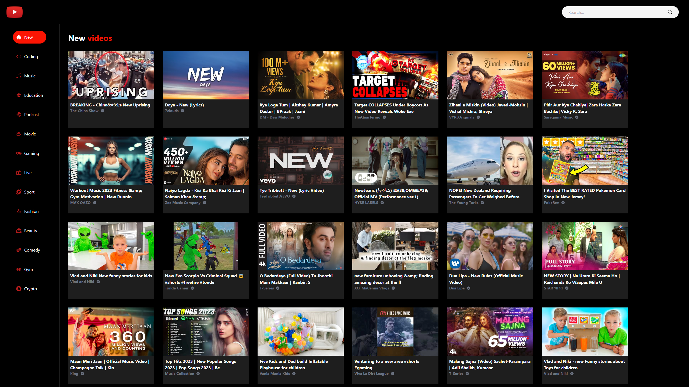
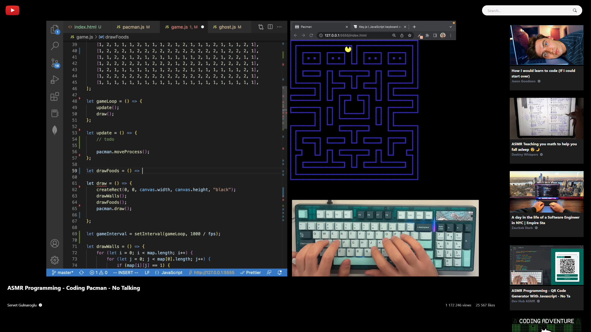
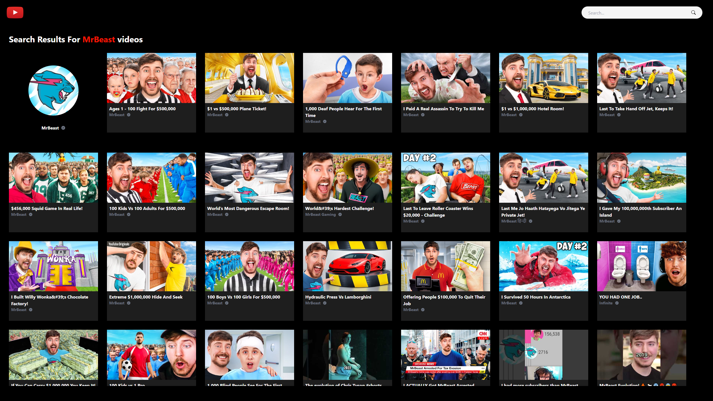
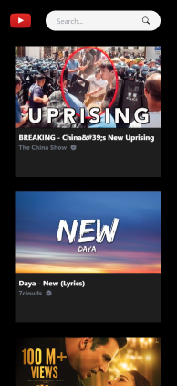
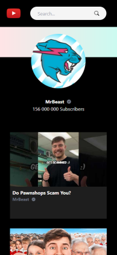

<br/>
<div align="center">
  <a href="">
    
  </a>

  <h1 align="center">YouTube Clone Website</h1>

  <p align="center">
    <a href="https://yt-clone-react-ts-rf.netlify.app/" target="_blank"><strong>Live Website »</strong></a>
    <br/>
    <br/>
  </p>
</div>

<details>
  <summary>Table of Contents</summary>
  <ol>
    <li>
      <a href="#about-project">About Project</a>
    </li>
    <li>
      <a href="#screenshots">Screenshots</a>
    </li>
    <li><a href="#tech-stack">Tech Stack</a></li>
    <li>
      <a href="#installation">Installation</a>
    </li>
  </ol>
</details>
 <br />

## About Project

YouTube-inspired website built using React JS, TypeScript and designed using Tailwind CSS. Website is fully responsive and uses reusable components that take certain props. The entire website is based on fetching data using Axios from Rapid API. It allows to search for movies and channels by popular categories or by phrases typed into the searchbar. Thanks to React Player, videos can be watched as on YouTube. Each video has its own dynamically generated page that, in addition to the video itself, also contains its statistics and related videos. Each channel also has its own dynamically generated page, which contains the channel's statistics and the videos shared on it.

## Screenshots



 
 &nbsp;  

## Tech Stack

- 
- 
- 
- 
- Axios
- React Icons
- React Spinners
- React Player

## Installation

To get started with this project, simply clone the repository:

```bash
git clone https://github.com/Vertori/yt-cln-react-ts.git
```

To setup API, go to [Rapid API Website](https://rapidapi.com/) and create an account.<br/>
Enable this API to fetch youtube videos and channels: [API: Youtube v3 by ytdlfree](https://rapidapi.com/ytdlfree/api/youtube-v31/).<br/>
Copy your Rapid API Key<br/>
Create .env file in root folder<br/>
Paste your Rapid API Key to your .env file as shown below

```bash
VITE_RAPID_API_KEY = 'Your Rapid API Key'
```

Use the package manager [npm](https://www.npmjs.com/) to install the dependencies.

```bash
npm install
```

After that, run the following command to start the development server:

```bash
npm run dev
```
